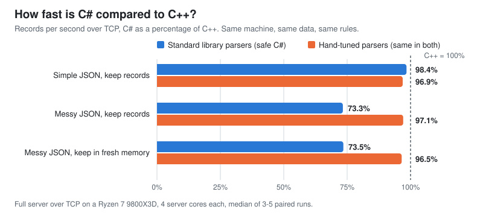

# NetBench++#

**C# vs C++, measured fairly.** Two TCP servers do exactly the same job: receive batches of JSON, validate every field, crunch the numbers and reply. One is written in C# on .NET 11, the other in C++23. They run on the same machine with the same data and must return bit-identical answers. Then we see which one is faster, and why.


<p align="center">
  
</p>

## The short version

- **On simple JSON it's basically a tie.** C# runs at 95-99% of C++ speed.
- **On messy, real-world JSON, C++ wins by 30-42%.** Under normal load its slowest replies are also 1.7-3x quicker.
- **The networking itself is a tie.** Both servers move raw bytes equally fast.
- **The whole gap is the JSON parser:** simdjson (C++) against System.Text.Json (C#).
- **C# uses 4-5x more memory.**

## Results

| Contest | Winner | Margin |
| --- | --- | --- |
| Simple JSON, max speed | C++ (barely) | +5% (14.6 vs 14.0 million records/s) |
| Simple JSON, keep records in memory | Tie | +1.5% (11.2 vs 11.1 million records/s) |
| Simple JSON, half load | Tie | about 0.16-0.2 ms per reply for both |
| Messy JSON, max speed | C++ | +42% (3.39 vs 2.34 million records/s) |
| Messy JSON, keep records in memory | C++ | +32% (2.47 vs 1.94 million records/s) |
| Messy JSON, keep records in fresh memory | C++ | +30% (2.44 vs 1.90 million records/s) |
| Messy JSON, normal load (70%) | C++ | slowest 1% of replies: 2.8-3.4 ms vs 4.4-11.5 ms |
| Messy JSON, traffic bursts | C++ | C# turned away about 3x more requests |
| Networking only, no JSON | Tie | 99.6% on mixed frame sizes (the load generator is the limit) |
| Memory | C++ | 15-21 MiB vs 76-85 MiB (simple); 0.2 vs 1.0 GiB (fresh memory) |

These numbers come from 270 runs (4.4 hours, zero failures) on a Ryzen 7 9800X3D under Windows 11. Each figure is the median of 3-7 back-to-back C#/C++ pairs, run in random order. "Simple" records are about 160 bytes of ASCII JSON. "Messy" records are about 770 bytes, with shuffled fields, escapes, Unicode and long text. The [full results](docs/benchmarks/results.md) have every table, range and excluded run.

## Why C++ wins on messy JSON

We measured each piece separately.

- **Parsing alone, one core, no network:** C# reaches 99-102% of C++ on simple JSON but only 67-75% on messy JSON.
- **Networking only:** a tie.
- **Where the time goes:** on messy input, .NET's `Utf8JsonReader` spends about as long just splitting the text into tokens as simdjson spends on its entire parse. simdjson checks 64 bytes at a time with SIMD instructions. C# also has to decode every escaped string in a second pass.
- **We tried to beat .NET's own string decoder.** Two hand-written versions were 7-13% slower, so this isn't a case of lazy C#.
- **Garbage collection shows up when every batch needs fresh memory.** Even with a tuned GC, C# pauses for about 0.8 s per minute; with .NET's default settings it's 4 s per minute. C++ frees memory as it goes.
- **Equal load isn't equal effort.** At 70% load, C# runs at 70% of its own capacity while the faster C++ server is only at about 54% of its own. So C#'s queues, and its slow replies, grow first.

Before this round of work, C# was noticeably slower on simple JSON too (86% of C++). Checking field names and plain strings in place, instead of copying them first, closed that gap.

## How it works

1. **The load generator** opens 16 TCP connections to the server over loopback (same machine, so the network is never the bottleneck) and sends batches of JSON records. Each record has an id, a timestamp, a source, a kind, a value, some flags and a text message.
2. **The server** checks every field against a strict schema. That means exact field names, number ranges, valid UTF-8 and no duplicates, and one bad record rejects the whole batch. Then it does one of three things:
   - **check and total:** add the record to running totals and a checksum;
   - **keep records:** also keep typed copies of the last 64 batches, reusing buffers;
   - **fresh memory:** the same, but allocate new memory for every batch.
3. **The server replies** with an acknowledgement. At the end, client and server compare checksums over everything processed, so skipped or mangled work fails the run.

It measures two things:

- **Max speed:** every connection keeps 4 batches in flight, and we count records per second.
- **Normal load:** batches arrive on a fixed or random schedule, and we measure how long each one waits from when it *should* have arrived until it's answered. Timing from the scheduled arrival means a stalled server can't hide its delays.

### Is it fair?

- Both servers get the same 4 CPU cores. The load generator gets 3 other cores, and one more core is left free for Windows.
- The load generator is the same program for both servers. Swapping in a C#-written one doesn't change the result.
- Every run checks that the load generator itself kept up. Runs where it didn't are excluded and listed, never hidden. The rules were written down before collecting results.
- Both implementations are checked against an independent Python reference on every record of the test data.
- Each side uses its natural JSON library: simdjson for C++, System.Text.Json for C#. That's part of what's being compared. The C# server runs with a throughput-oriented GC setting (DATAS off), and the results include .NET's default setting too.

The results come from one machine over loopback. A different CPU, .NET version, JSON library or real network could move the numbers. This says nothing about which language is "better" in general.

## Run it yourself

You'll need Windows x64 with at least 6 physical cores, the .NET SDK pinned in [global.json](global.json), Visual Studio 2026 C++ tools with CMake, and Python 3.11+ (no packages).

```powershell
./bench/build.ps1                                                     # build both servers
./tests/run_all.ps1                                                   # every correctness check (add -Asan for AddressSanitizer)
./bench/run.ps1 -Matrix bench/matrices/smoke.json -Output results/smoke        # 2-minute sanity run
./bench/run.ps1 -Matrix bench/matrices/campaign.json -Output results/campaign  # the full benchmark, about 4.5 hours
```

Each run writes `report.md`, `trials.csv` and the raw JSON of every trial into its output folder.

## What's in here

| Folder | What it holds |
| --- | --- |
| [src/cpp](src/cpp) | C++23 server, load generator and self-tests (IOCP, simdjson) |
| [src/dotnet](src/dotnet) | C# server, load generator and self-tests (async sockets, System.Text.Json) |
| [bench](bench) | Build script, campaign runner, report generator and [test plans](bench/matrices) |
| [tests](tests) | Protocol, fault-injection, timing and cross-implementation tests |
| [tools](tools) | Test-data generator with an independent Python reference |
| [docs](docs) | Results, methodology, protocol and history |
| [results](results) | Published raw data from the campaigns and diagnostics |
| [reviews](reviews) | Code review and audit records |

## Going deeper

- [Full results](docs/benchmarks/results.md): every table, ranges, GC and memory, excluded runs, facts vs hypotheses
- [Methodology](docs/benchmarks/methodology.md): the rules fixed before measuring, and what the diagnostics found
- [Protocol and result format](docs/contract.md): wire format, validation rules, load models, JSON schema
- [C++ implementation](src/cpp/README.md) and [C# implementation](src/dotnet/README.md): design notes and build details
- [Audit record](reviews/round3/README.md): every bug found and fixed, the C# optimization work, and what didn't pan out
- [C# optimization diagnostics](results/diagnostics-csharp-parser-20260929/README.md): the A/B tests and ablations behind the "why"
- [First benchmark pass](docs/benchmarks/first-pass.md): the original run, kept for history, and why its latency conclusion didn't survive
- [Design proposal](docs/design-proposal.md): the original plan for the experiment

## License

MIT, see [LICENSE](LICENSE).
